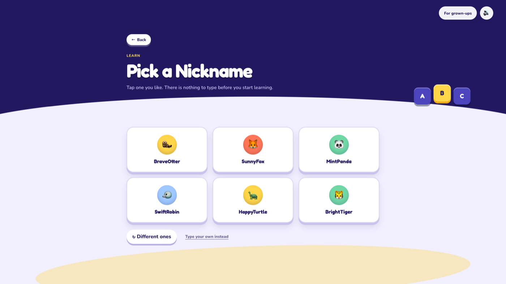
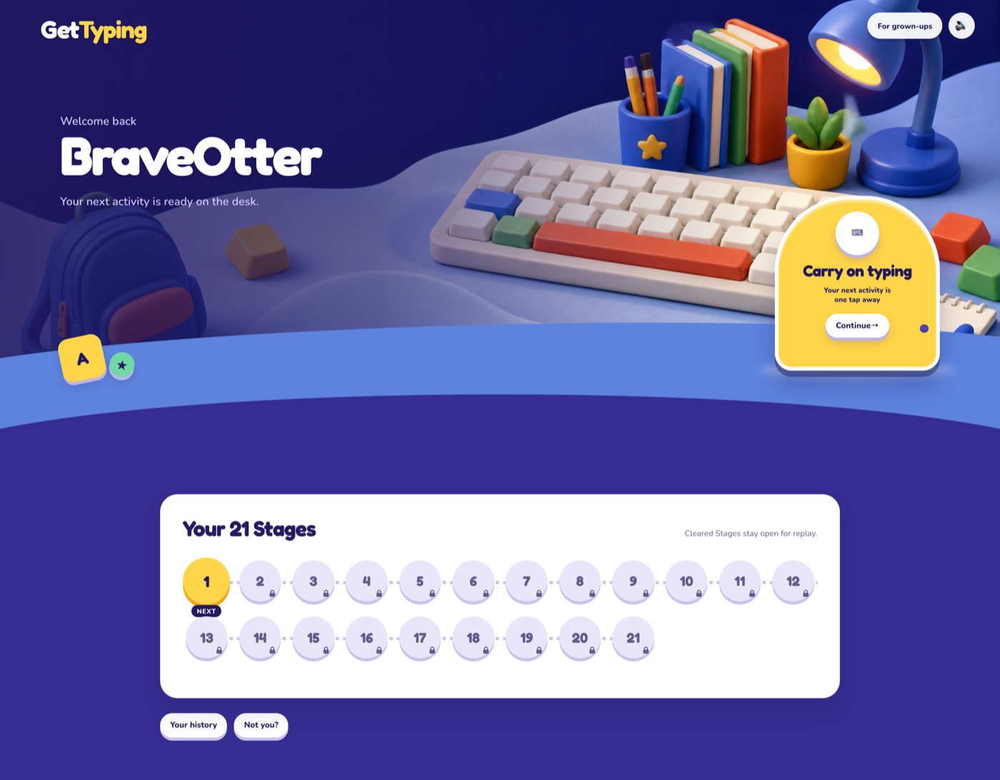
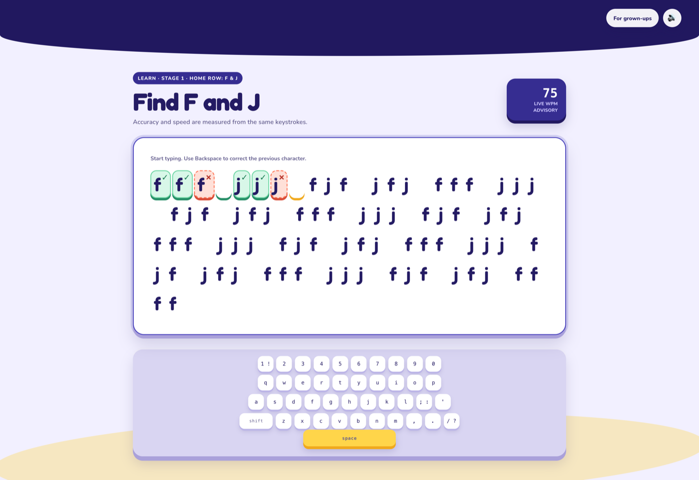

# GetTyping

A web-based, SQLite-backed typing tutor. It teaches beginners — including young children — to type stage by stage, and helps people who already type improve their speed through diagnostic testing and targeted practice.

## The two Tracks

- **Learn** — a gated, 21-Stage curriculum (home row → top row → bottom row → shift/punctuation → numbers). Each Stage teaches one to three new keys and gates on 90% accuracy, never speed. Cleared Stages stay open for replay. The on-screen keyboard marks which finger belongs on each key.
- **Speed Test & Practice** — an ungated diagnostic Speed Test and Practice Exercises generated on the fly from the Player's Weak-key Profile. A Speed Test Score **or** a Learn Score unlocks Practice; a Nickname-only Player is sent to the Speed Test first. Returning home offers **Practise weak keys** as a secondary action once eligible — Continue still points at the next Stage, or the Speed Test after graduation.

Every Exercise has its own per-Exercise Leaderboard (there's no single global ranking — see [ADR 0002](docs/adr/0002-per-exercise-leaderboards.md)). There are no accounts: a Player is just a chosen Nickname held in a long-lived cookie, no password or email required (see [ADR 0001](docs/adr/0001-nickname-only-identity.md)).

`CONTEXT.md` at the repo root defines the full domain vocabulary (Track, Stage, Exercise, Attempt, Score, Player, Nickname, Leaderboard, Weak-key Profile) — read it before working on anything that touches these concepts.

## Admin

A gated `/admin` page for the site operator: aggregate, Nickname-free usage statistics — Player growth, Attempt engagement, the Learn-Track funnel across all 21 Stages, Speed Test & Practice performance, and content popularity. Nothing else in GetTyping has accounts or passwords, so this is deliberately its own thing — a single shared `ADMIN_TOKEN` gates the whole `/admin/*` subtree via an httpOnly session cookie. Locally, see `ADMIN_TOKEN` under [Getting started](#getting-started); in production it's a Fly secret (see [Deploying](#deploying)). Login attempts are rate-limited per source IP — 5 failed attempts locks that IP out for 15 minutes (`429`, resets on a correct login) — to blunt brute-forcing of the token.

## Screenshots

<p align="center">
  
  
</p>
<p align="center">First visit — choose a Track by intent, not age. Learn's Nickname step: tap a curated card, nothing to type.</p>

<p align="center">
  
  
</p>
<p align="center">Returning Player's home screen and Stage path. Mid-Stage: per-character feedback and the on-screen keyboard.</p>

<p align="center">
  
</p>
<p align="center">Speed Test — the same mechanics, a tighter type scale.</p>

## Stack

- [SvelteKit](https://svelte.dev/docs/kit) on `adapter-node`
- [better-sqlite3](https://github.com/WiseLibs/better-sqlite3) + [Drizzle ORM](https://orm.drizzle.team/), WAL mode
- [Vitest](https://vitest.dev/) for tests, run against a real HTTP server and a freshly migrated database — no unit tests reach past HTTP into internal functions
- Deploys as a single [Fly.io](https://fly.io/) VM with a persistent volume, streamed to object storage by [Litestream](https://litestream.io/) (see [ADR 0004](docs/adr/0004-single-vm-sqlite-litestream-deploy.md))

## Getting started

Requires Node 22+.

```bash
npm install
DATABASE_PATH=./gettyping-dev.sqlite npm run migrate
DATABASE_PATH=./gettyping-dev.sqlite npm run dev
```

`DATABASE_PATH` names the SQLite file and is required — there's no default. `npm run migrate` creates the schema and seeds the 21 Stages and 22 Exercises (content included) before the first `npm run dev`.

Set `ADMIN_TOKEN` to reach `/admin` locally — it has no default, so `/admin` stays unreachable until it's set:

```bash
ADMIN_TOKEN=dev-token DATABASE_PATH=./gettyping-dev.sqlite npm run dev
```

## Scripts

| Command                  | What it does                                                       |
| ------------------------- | -------------------------------------------------------------------- |
| `npm run dev`              | Start the Vite dev server                                            |
| `npm run build`             | Production build (adapter-node)                                      |
| `npm run check`             | `svelte-kit sync` + `svelte-check`                                    |
| `npm run migrate`           | Run Drizzle migrations against `DATABASE_PATH`, seeding curriculum data |
| `npm test`                  | Build, then run the full Vitest suite                                 |
| `npm run test:acceptance`   | Build, then run only `tests/acceptance` (HTTP-level acceptance tests) |
| `npm run test:deploy`       | Run `tests/deploy` (the standalone migration script)                  |

## Deploying

Single Fly.io VM, a persistent volume for the SQLite file, Litestream streaming that file to object storage. Full walkthrough — provisioning, secrets, and how to prove a backup actually restores — is in [docs/deploy.md](docs/deploy.md).

## Project docs

- [`CONTEXT.md`](CONTEXT.md) — domain glossary, read before naming any domain concept
- [`docs/adr/`](docs/adr/) — architectural decision records
- [`docs/agents/`](docs/agents/) — conventions for agent-driven work in this repo (issue tracker, triage labels, domain-doc consumption rules)
- [`.scratch/gettyping-spec/`](.scratch/gettyping-spec/) — the build-ready spec and its ticket history (tickets 01–37); superseded going forward by GitHub Issues, see `docs/agents/issue-tracker.md`
